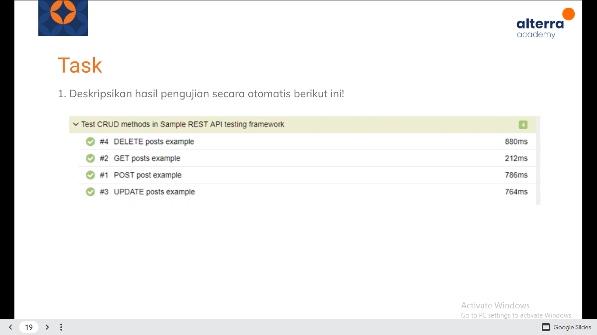
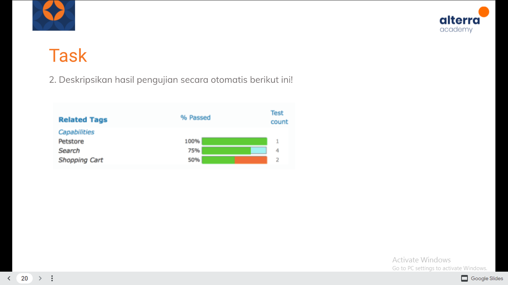

# From Manual to Automation Testing
 
## Tugas praktikum From Manual to Automation Testing
### Slide 19

Disajikan data hasil pengujian dari suatu software bernama allure. Pada slide tersebut menjelaskan ada bagian fitur ada juga bagian story task / test case. Pada fitur tersebut terdapat story case dengan 4 method yaitu delete, get, post, dan update. Dalam data tersebut juga ditunjukkan durasi pengujian terhadap respon dari suatu page bagian yang diuji. 
Pada method delete posts example setelah melakukan pengujian akan berstatus passed dengan membutuhkan durasi pengujiannya sebesar 880ms yang menunjukkan bagian ini membutuhkan respon atau durasi pengujian yang begitu lama sehingga bisa dikatakan method ini akan membutuhkan durasi respon yang sedikit lebih lama.
Pada method get posts example setelah melakukan pengujian akan berstatus passed dengan membutuhkan durasi pengujian 212ms yang menunjukkan bahwa bagian ini membutuhkan respon atau durasi pengujian yang lumayan lama sehingga bisa dikatakan method ini membutuhkan durasi respon sedikit lama.
Pada method post post example setelah melakukan pengujian akan berstatus passed dengan membutuhkan durasi pengujian 786ms yang menunjukkan bahwa bagian ini membutuhkan respon atau durasi pengujian yang lumayan lama sehingga bisa dikatakan method ini membutuhkan durasi respon sedikit lebih lama.
Pada method update posts example setelah melakukan pengujian akan berstatus passed dengan membutuhkan durasi pengujian 764ms yang menunjukkan bahwa bagian ini membutuhkan respon atau durasi pengujian yang lumayan lama sehingga bisa dikatakan method ini membutuhkan durasi respon sedikit lebih lama.

Kesimpulannya pada fitur diatas semua method atau story task berstatus passed namun dengan durasi pengujian atau respon yang berbeda-beda. Method atau story task yang membutuhkan durasi sedikit dalam pengujiannya adalah method get sehingga dibandingkan yang lainnya method ini lebih merespon lebih cepat daripada method lain dan method ini lebih bagus karena durasi yang dibutuhkan lebih sedikit daripada method lainnya

### Slide 20

Pada slide itu tersedia test report hasil pengujian suatu fitur dengan jumlah persentase dan jumlah test casenya.
Pada fitur Petstore didalamnya terdapat 1 test case yang diuji menggunakan software tersebut. Hasil pengujian fitur tersebut menunjukan persentase 100% yang mana itu berarti case tersebut sudah 100% berhasil dites dan tidak ada bug dan test case tersebut berstatus passed.
Pada fitur Search didalamnya terdapat 4 test case yang akan di uji atau di runs. hasil menunjukkan persentase 75% test case sudah di uji dan berstatus passed. Namun ada 1 test case yang belum diuji yang mengakibatkan 25% dari hasil pengujian belum ter-run sehingga di bagian persentase masih ada bagian yang belum terpenuhi/kosong.
Pada fitur Shopping Cart didalamnya terdapat 2 test case yang akan diuji pada software tersebut. Hasil pengujian menunjukkan 50% dari hasil pengujian berstatus passed sedangkan 50% dari hasil pengujian berstatus failed. Maka dari itu pada persentase ditunjukkan dengan 2 warna yang berbeda yaitu hijau yang menunjukkan status passed, dan merah yang menunjukkan status failed. Sehingga 1 test pada test casenya berstatus passed dan 1 yang lainnya berstatus failed.

## Resume  
Dalam materi ini mempelajari :
1. Apa itu manual testing ?
2. Kelebihan dan kekurangan manual testing
3. Apa itu Automation Testing?
4. Kenapa harus menggunakan automation testing 

## Apa itu manual testing ?
Pengujian manual atau manual testing merupakan langkah untuk menemukan cacat atau bug pada program perangkat lunak, dalam metode ini tester memiliki peran penting sebagai pengguna akhir untuk memeriksa semua fitur aplikasi berfungsi dengan baik. Penguji melakukan pemeriksaan manual tanpa menggunakan alat bantu atau script, tujuannya adalah untuk memastikan bahwa aplikasi yang diuji bebas dari cacat dan perangkat lunak aplikasi dapat bekerja seperti yang diharapkan. Pengujian manual juga memainkan peran penting dalam pengujian visual di mana alat otomatisasi tidak bisa.
   
Manual tester dapat mendeteksi kontras antara tombol dan latar belakang yang lebih terang, sehingga menyulitkan pengguna untuk menemukan tombol dan memahami tindakan yang harus diambil. User Interface (UI)feedback adalah sesuatu yang tidak dapat ditemukan menggunakan pengujian otomatis.

## Kelebihan dan kekurangan manual testing
a. Kelebihan
1. Mendapatkan visual feedback 
Tools dan Scripts tidak bisa membantu dalam memberikan opini atau masukan tentang tampilan UI.
2. Less expensive in the short-term projects
Jika Anda hanya menguji aplikasi sederhana yang tidak memiliki terlalu banyak pembaruan, maka pengujian manual tidak perlu menggunakan alat atau perangkat lunak yang mahal.
3. The human element
Dapat memperoleh umpan balik dari orang-orang secara real time sehingga mereka tahu apa yang disukai dan tidak disukai pengguna (Dimana automated tools tidak dapat memberikan umpan balik).

b. Kekurangan
1. Kurang teliti daripada automantion testing
Terkadang ada kesalahan manusia atau ketidakakuratan, jadi menggunakan pengujian otomatisasi akan mengurangi bug yang seharusnya terlewatkan.
2. Not reusable
Jika Anda menemukan banyak perubahan, Anda harus memeriksa kembali secara manual dari awal untuk memastikan perubahan baru tidak merusak aplikasi yang sudah selesai.
3. Kelelahan terhadap tester
Jika QA tester sudah sangat familiar dengan aplikasi, ia selalu mengujinya secara terus menerus agar QA tester benar-benar mengerti alur dari aplikasi tersebut. Jadi ini akan menyebabkan kelelahan dan kesalahan sehingga melewatkan beberapa hal dan membuat kesalahan.

## Apa itu Automation Testing?
Merupakan pengujian yang membutuhkan automation tools untuk menjalankan Test case. QA perlu membuat skrip yang akan berjalan dengan bantuan automation tools yang secara otomatis akan memvalidasi perangkat lunak yang diuji.

Automation testing bergantung pada skrip pengujian yang berjalan secara otomatis, fungsinya untuk membandingkan hasil yang diharapkan dengan hasil yang sebenarnya. Untuk mengetahui apakah aplikasi berjalan sesuai dengan yang diharapkan, penggunaan pengujian otomatis dapat dilakukan berulang kali. Jadi jika hasilnya tidak sama dengan yang diharapkan, Anda akan mendapatkan bug.

## Kelebihan dan Kekurangan Automation Testing
a. Kelebihan
1. Dapat menemukan bug lebih banyak dari manual tester 
Script dapat mencari lebih dalam, sehinga dapat menemukan bug yang tester tidak dapat temukan.
2. Kecepatan dan efisiensi
Script lebih cepat dari tester, sehingga dapat cepat selesai dalam menemukan bug.
3. Tes yang dapat dilakukan berulang dengan coding yang dapat di update secara berkala. Jika selalu mendapatkan update dan perubahan masing-masing unit/feature, maka tidak perlu menulis ulang scripsts setiap saat dan dapat digunakan kembali pada regression testing.

b. Kekurangan
1. Lebih Mahal
Karena menggunakan tools maka pengerjaan menggunakan atuomation testing akan mahal, namun tetap menghemat waktu serta usabilitas.
2. Kurangnya human element
seperti pada info sebelumnya, manual testing memberikan human element untuk dapat melakukan interaksi user dengan aplikasi termasuk secara visual.
3. Tidak adanya feedback mengenai UI
Tanpa adanya human element, maka kita tidak bisa melakukan pengecekan terhadap UI seperti warna, kontras, pemilihan font, dan button sizes.

## Kenapa harus menggunakan automation testing 
Karena Automation testing merupakan cara terbaik untuk meningkatkan efektiivitas cakupan pengujian dan kecepatan eksekusi dalam pengujian perangkat lunak. 
Software atau machine testing penting karena beberapa alasan :
1. manual testing yang di lakukan dari semua alur kerja dan semua skenario negative akan memakan waktu dan uang yang sangat banyak
2. Sulit untuk menguji situs multibahasa secara manual 
3. Automation test dalam software tidak perlu memerlukan campur tangan manusia
4. Automation test dapat meningkatkan kecepatan eksekusi tes
5. membantu meningkatkan scope dari sebuah test itu sendiri

## Test Case Yang Bisa Di Automate
1. Test case executed repetedly
Test case tersebut di executed berulang kali, jadi ketika kita melakukannya secara manual itu akan membuang waktu kita.
2. Test case yang sulit dilakukan secra manual
3. Test case yang membutuhkan waktu lama ketika dilakukan secara manual

## Test Case Yang Tidak Bisa Di Automate 
1. Test case yang baru dirancang dan belum pernah di executed
2. Test case yang memiliki requirements yang sering berubah

## Automate Testing Process
1. Test tool selection
2. Define scope of automation
3. Planning, design and development
4. Test Execution 
5. Maintenance

## Best Practise
1. Scope of Automation 
2. memilih automation tools yang tepat
3. scripting standart
4. measure metrics