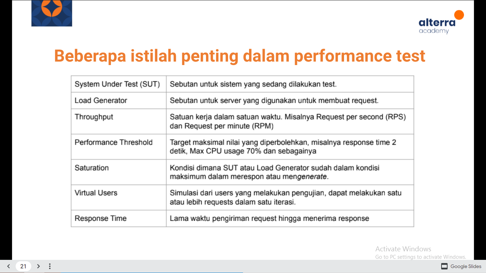

# Fundamental Perfomance Test

# Resume
Yang dipelajari pada materi ini:
1. Perfomance Test
2. Mengapa Perfomance Test Jarang dilakukan
3. Metode Perfomance Test

# Perfomance Test
Teknik non functional testing untuk menentukkan parameter sistem dalam hal responsif dan stabilitas dibawah berbagai beban (load) kerja.

Perfomance testing mengukur kualitas atribut dari sistem seperti stabilitas, ketahanan (reliability) dan penggunaan sumber daya.

## Apa Yang Diukur Dari Perfomance Test
1. Perfoma suatu aplikasi sampai suatu batas tertentu
2. Bukan merupakan functional-test
3. Bisa dalam berbagai macam bantuk untuk memahami realibility, stability, dan availability pada environment-nya.
	contoh:
	- Mengamati response time ketika menjalankan request dalam jumlah yang sangat banyak
	- Melihat suatu sistem berinteraksi dengan jumlah data yang cukup besar.

## Mengapa Performance Test Jarang Dilakukan?
Pada umumnya perfomance testing cukup mahal untuk diaplikasikan dan dijalankan, namun dapat dijadikan tolak ukur apakah sistem tersebut dapat mengakomodasi traffic yang ada.

Hal ini disebabkan karena pengetesannya memerlukanpersiapan yang dimana beberapa kasus harus membuat environment terpisah dari production agar tidak tercampurnya data test dengan data production.

Environment ini ada juga yang membuatnya di server cloud yang biayanya bisa lebih besar dari environment production. 

## Apa Yang Perlu Diperhatikan Dari Perfomance Test?
Dalam melakukan perfomance test biasanya yang menjadi perhatian adalah throughput dan response data-nya.

## Contoh Kasus Perfomance Test
Sebuah sistem baru yang akan di launch ke production, namun sebelum masuk ke production perlu dilakukan perfomance test untuk mengetahui throughput dan response time dari sistem tersebut.

Untuk informasi endpoint yang akan di test adalah:
1. /login
2. /beli-pulsa
3. /cek-out

Langkah yang harus dilakukan:
1. Membuat test plan 
2. Membuat script test
3. Melakukan perfomance test
4. Menganalisa hasil perfomance test

# Metode Performance Test

## Contoh Kasus Perfomance Test
Sebuah sistem baru yang akan di launch ke production, namun sebelum masuk ke production perlu dilakukan perfomance test untuk mengetahui throughput dan response time dari sistem tersebut.

Untuk informasi endpoint yang akan di test adalah:
1. /login
2. /beli-pulsa
3. /cek-out

Langkah yang harus dilakukan:
1. Membuat test plan 
2. Membuat script test
3. Melakukan perfomance test
4. Menganalisa hasil perfomance test

## A. Membuat Test Plan
Kenali yang dibutuhkan:
1. Endpoint yang akan ditest:
	- / login
	- / beli_pulsa
	- / cek_out
2. Kebutuhan masing-masing endpoint:
	- Username dan Password untuk endpoint/login
	- Produk, denom dan nomor untuk pengetesan untuk endpoint
	- Metode pembayaran yang dipilih untuk endpoint /cek_out

## B. Menentukan Metode Test
1. Pilih berdasarkan kondisi sistem, apakah belum pernah dites atau sudah 
	- Selalu awali dengan load test untuk tahu kondisi awal sistem'
2. Pilih berdasarkan situasi yang akan dihadapi

## C. Some Types of Performance Tests
- Load Test
- Endurance Test
- Stress Test
- Peak Test

## D. Smoke Testing
Dilakukan untuk verify script yang sudah dibuat, apakah sistem tersebut dapat handle minimal load, tanpa masalah sama sekali. Biasanya hanya 1-2 VUs.

## E. Load Testing
Pengujian yang paling sederhana yang dilakukan untuk memahami perilaku sistem dalam keadaan beban tertentu. Hasil dari load test digunakan untuk mengukur kepentingan bisnis saat transaksi yang kritis dengan memonito dampak terhadap database, application server atau pendukung lainnya.

Sederhananya load testing menentukan kelakuan sistem pada saat kondisi normal dan puncak. Idealnya, kita mengetahui jumlah traffic yang ada di prod sebagai nilai di load test.

## F. Tabel Tier
Ini biasanya dijadikan patokan ideal suatu sistem baru yang belum pernah masuk ke production.

## G. Stress Testing
Metode ini untuk dilakukan untuk mengamati kemampuan dan kestabilan sistem pada saat kondisi ekstrem.

Dilakukan bertahap menuju load normal, puncak, dan melebihinya, lalu turun untuk melihat proses recovery.

## H. Spike Testing 
Seperti stress test, namun kenaikan langsung menuju melebihi puncak dilakukan dalam waktu singkat. Jika stress test memberikan waktu untuk scale-out, disini tidak.

Salah satu contoh adalah pada saat flash sale di suatu e-commerce, yang dimana banyaknya kunjungan pengguna yang langsung memuncak saat mengakses halaman flash sale.

## I. Soak Testing
Untuk mengetahui reliability ketika dalam tekanan di bawah puncak dalam jangka panjang (>=1 jam). Dapat mengetahui apakah terdapat bug pada race condition, memory leaks, db connection dsb.

Tips: Metode ini bisa dilakukan pada jam-jam sepi tidak ada transaksi pada sistem jika test dilakukan di production.

## J. Beberapa Istilah Penting Dalam Perfomance Test

