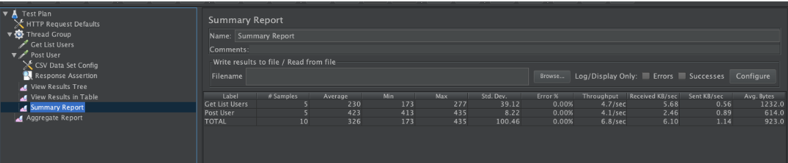
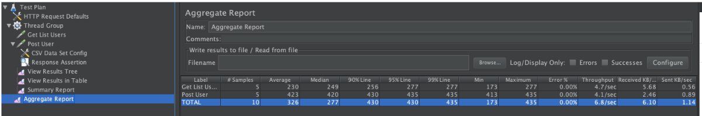
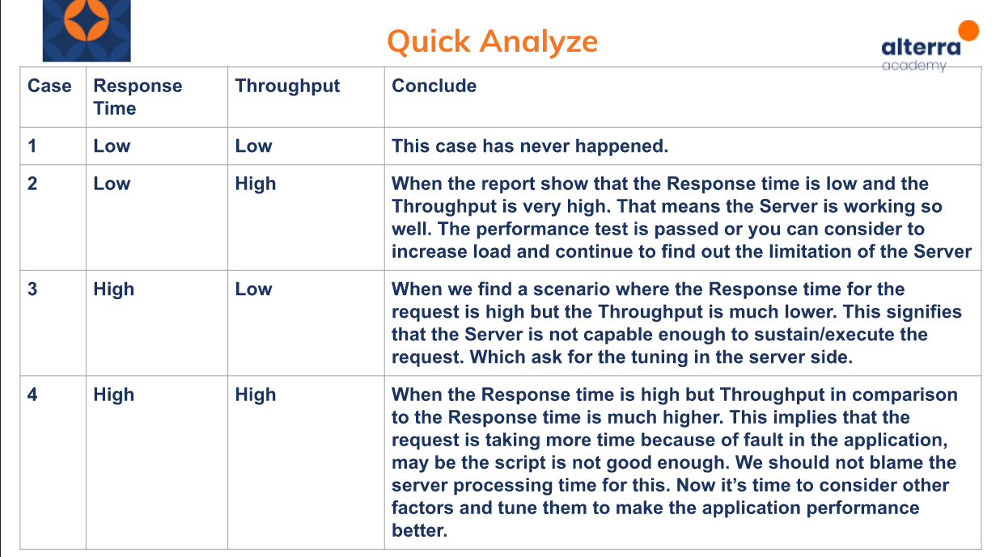

# Understanding Jmeter Result

## Hal yang dipelajari
1. Summary Report
2. Aggregate Report
3. Throughput
4. Quick Analyze

## Summary Report

## aggregate Report

## Throughput
menghitung throughput menggunakan rumus:

number of request / total time *coversation

keterangan:
- number of request : jumlah permintaan yang dieksekusi
- total time : (lastSampleStartTime + lastSampleLoadTime - firstSampleStartTime)
- conversation : Unit dari percakapan. Contoh 1000 akan mengkonversi nilai menjadi detik, 1000*60 akan mengkonversi nilai menjadi menit dan seterusnya

## Quick Analyze
