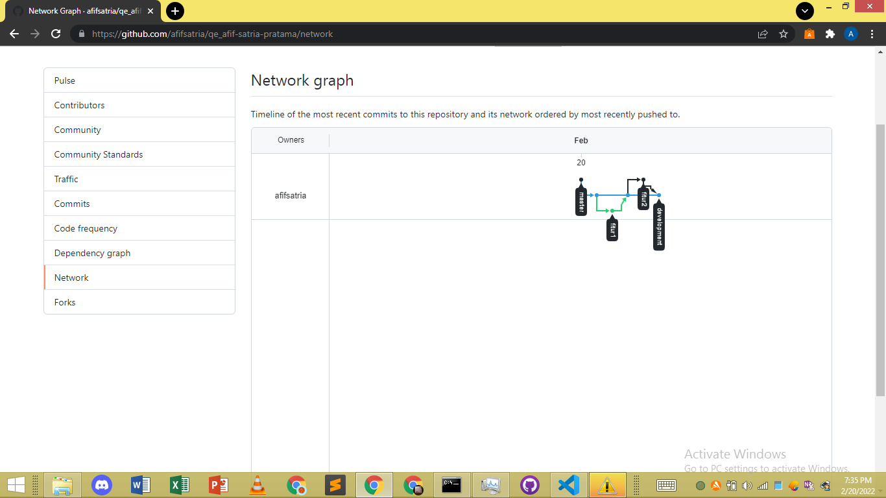

# Session 2 - Versioning control with Git

## Resume
Dalam materi ini kita mempelajari:
- Apa itu versioning
- Apa itu Git
- Cara penggunaan Git dan GitHub
- Membuat Repository
- Cara memasukkan file dari local directory ke GitHub
## A. Versioning / Version Control

- Sebuah sistem yang merekam perubahan-perubahan dari waktu ke waktu sehingga kita dapat melihat kembali versi tertentu suatu saat nanti
- Nantinya bertugas untuk mencatat versi yang dikerjakan oleh orang ataupun sebuah kelompok. 

## B. Revision is a must | dont expect every code is perfect

## C. GIT
- adalah salah satu version control system untuk mengembangkan software secara bersama-sama

## D. Mengoptimalkan kolaborasi development
-perlu membuat beberapa branch agar kolaborasi optimal
### 1. Membuat branch master dari branch development
    $ (master) git branch development
    $ (master) git checkout development
    atau bisa dengan langsung:
    $ (master) git -M development
### 2. Hindari direct edit ke branch development
    $ (development) git branch fitur1
    $ (development) git branch fitur2
### 3. Merge branch fitur hanya ke branch development
    $ (fitur1) git checkout development
    $ (development) git merge fitur1
### 4. Merge branch development ke branch ma
ster jika projek selesai
    $ (master)git merge development

E. Hasil Tugas Versioning
    