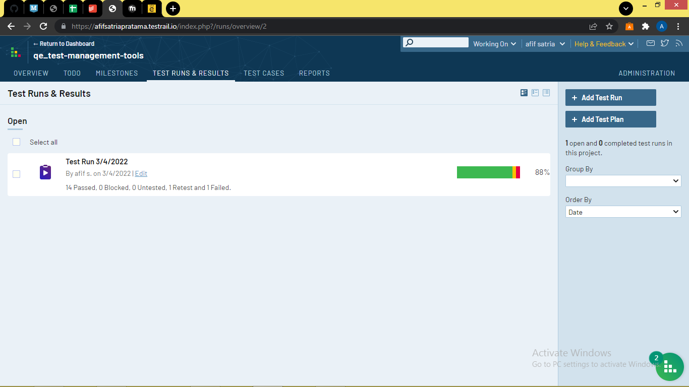

# Test Case Management Tools

## Resume
Dalam materi ini mempelajari:
1. Test Case Management Tools 
2. Mengapa kita membutuhkan Test Case Management Tools
3. Testrail

### Test Case Management Tools
Alat untuk memelihara banyak dokumen kasus uji

### Mengapa kita membutuhkan Test Case Management Tools
1. Plan and Estimate
Rencana Pengujian dapat didefinisikan sebagai dokumen yang menjelaskan fitur yang akan diuji, fitur yang tidak akan diuji, pendekatan, sumber daya, dan jadwal kegiatan Pengujian yang dimaksudkan.  Memperkirakan upaya untuk tes adalah salah satu tugas utama dan penting dalam Manajemen Tes
2. Monitoring and Controlling
Pemantauan adalah proses pengumpulan, pencatatan, dan pelaporan informasi tentang aktivitas proyek yang perlu diketahui oleh manajer proyek dan pemangku kepentingan. Mengontrol proses penggunaan data dari aktivitas pemantauan untuk membawa kinerja aktual ke kinerja yang direncanakan.
3. Reporting and Integrade with Another Tools
Alat manajemen kasus uji dapat menghasilkan laporan.  

Beberapa alat manajemen Test Case dapat diintegrasikan dengan alat lain seperti JIRA, Pivotal, Redmine, Jenkins, Travis CI

### TestRail
Cara menggunakan TestRail yaitu:
1. Membuka TestRail di browser dan sign in dengan autentikasi
2. Membuat Tes Projek Manajemen
3. Mengisi semua halaman mandatory
4. Membuat Milestones 
5. Membuat Tes Run
6. Membuat Tes Plan
7. Membuat Tes Case
8. Test Report

