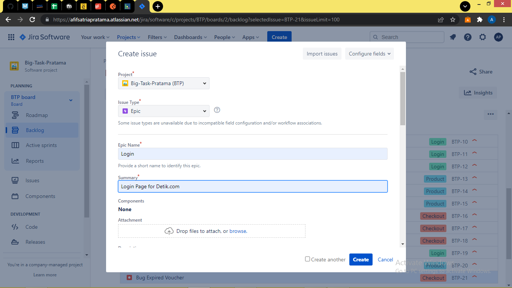
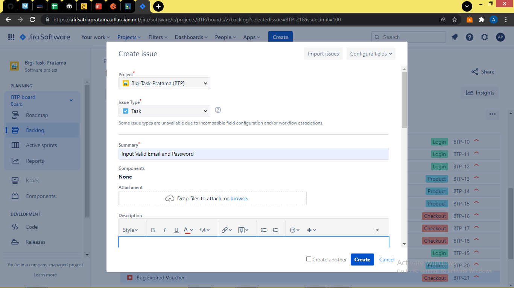

# Big Task 1 - Jira
Link Jira: https://afifsatriapratama.atlassian.net/jira/software/c/projects/BTP/boards/2/backlog?selectedIssue=BTP-20&issueLimit=100

1. Membuat epic untuk setiap halaman yang akan dikerjakan

2. Membuat task untuk setiap test case yang akan dicantumkan dari hasil tiap halaman

3. Membuat bug dari hasil pengujian test case jika dalam pengujian terdapat suatu bug

Catatan:
Gambar diatas hanya sebagian untuk disertakan guna menjelaskan dari setiap penjelasan. Untuk screenshots lengkap berada dalam folder ss

