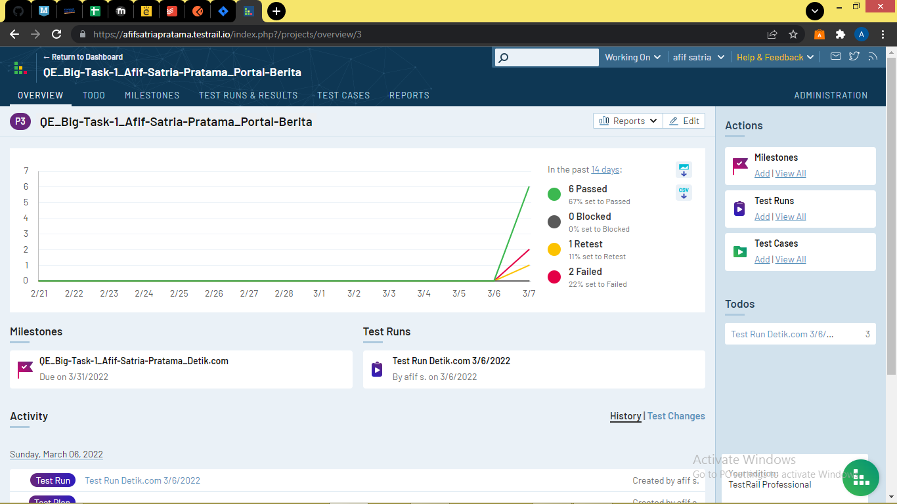
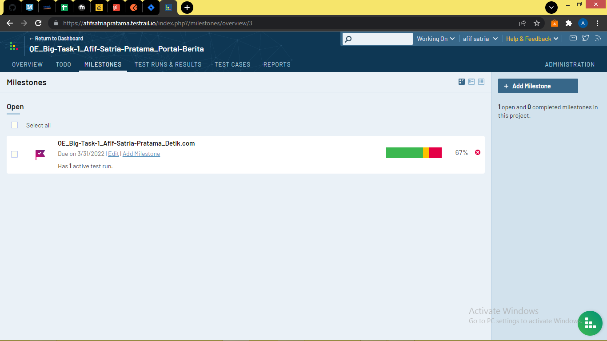
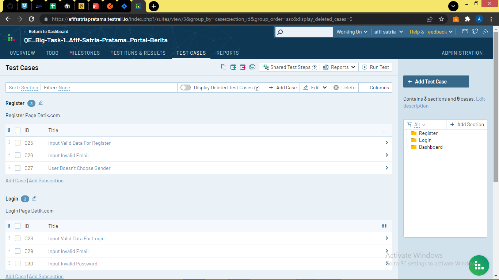
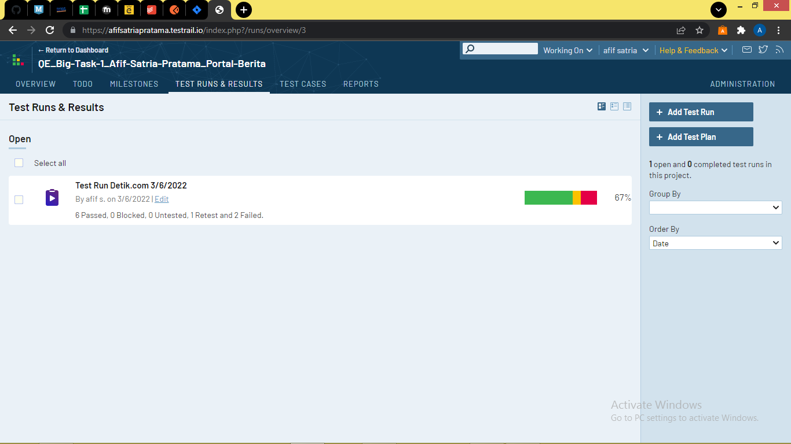

# Big Task 1 - Testrail
Link Testrail: 
1. Portal Berita (detik.com): https://afifsatriapratama.testrail.io/index.php?/projects/overview/3

2. Toko Online (shopee):https://afifsatriapratama.testrail.io/index.php?/projects/overview/4

# Penugasan
1. Membuat project sebagai tempat pengerjaan (Portal Berita & Toko Online)

2. Membuat milestones untuk setiap project

3. Membuat test cases untuk setiap pengujian project

4. Membuat test runs untuk melakukan pengujian dari test cases yang telah dibuat (Jika diperlukan membuat test plan maka membuat test plan)

Catatan:
Gambar diatas hanya sebagian untuk disertakan guna menjelaskan dari setiap penjelasan. Untuk screenshots lengkap berada dalam folder screenshots
