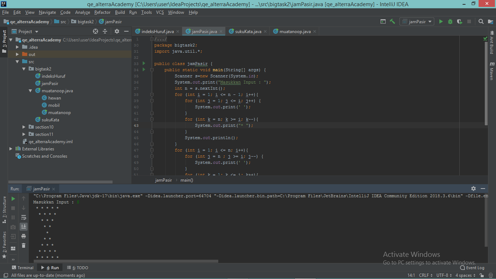
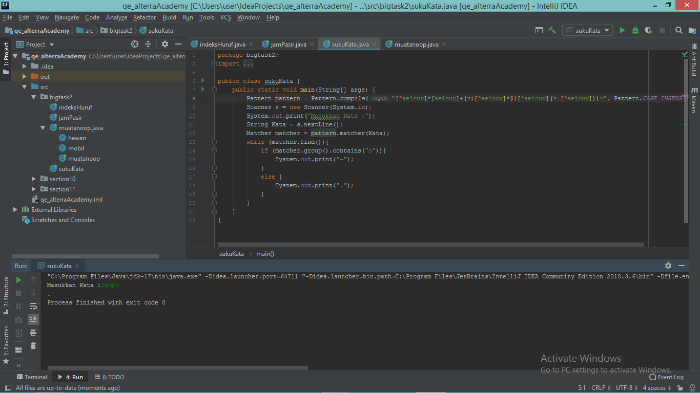
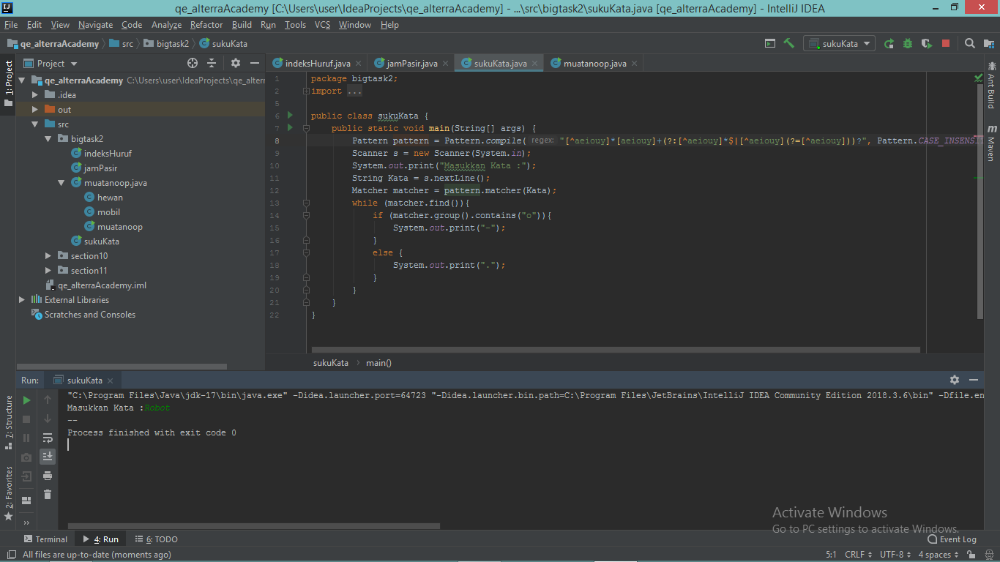
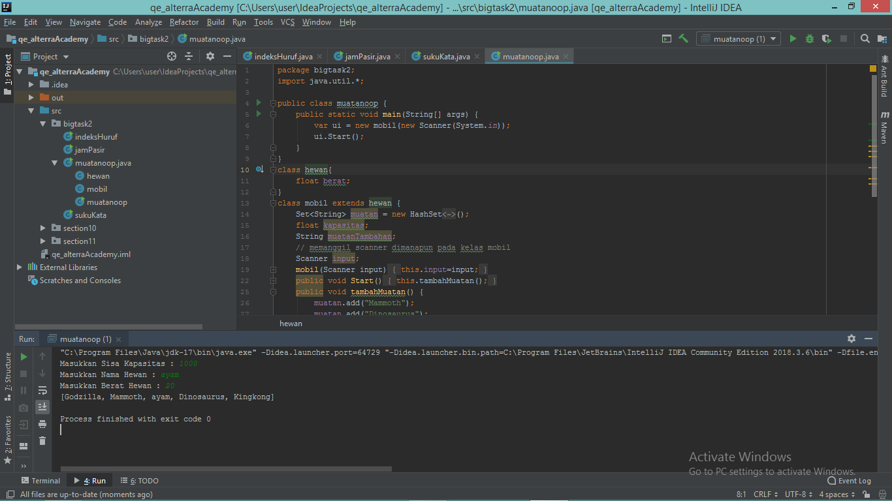
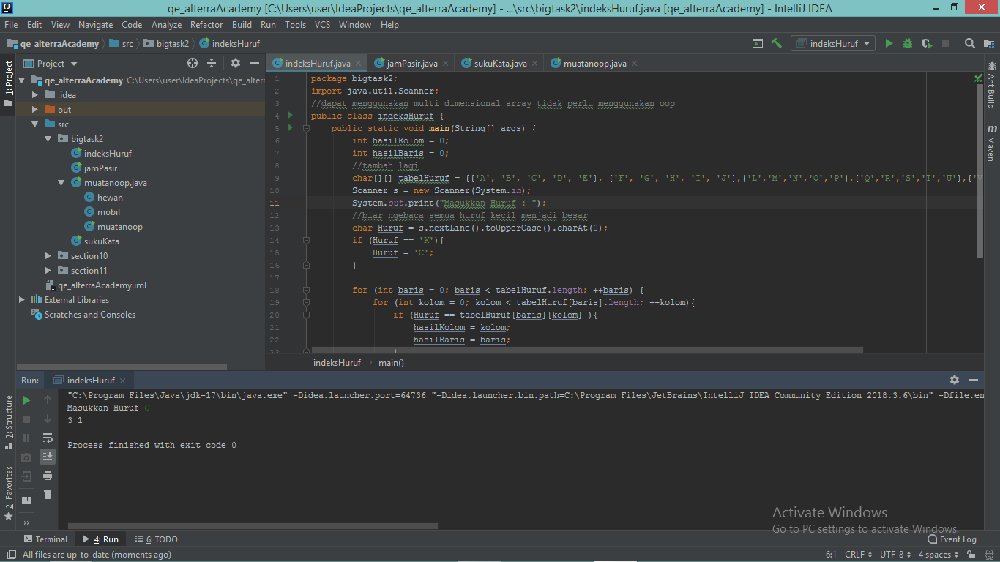
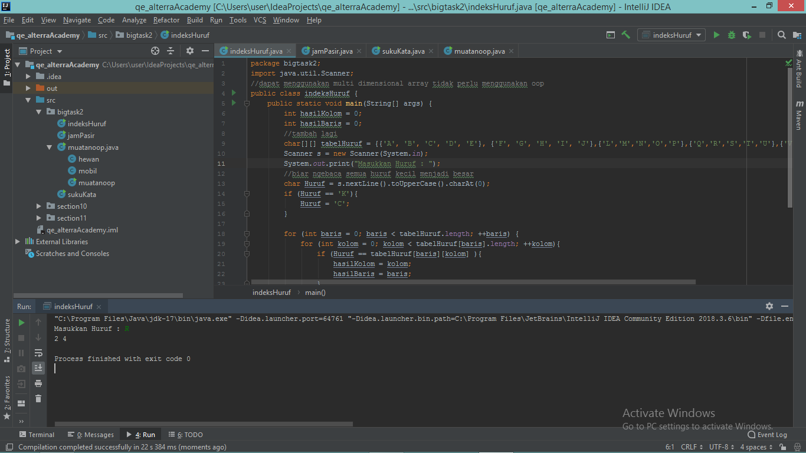
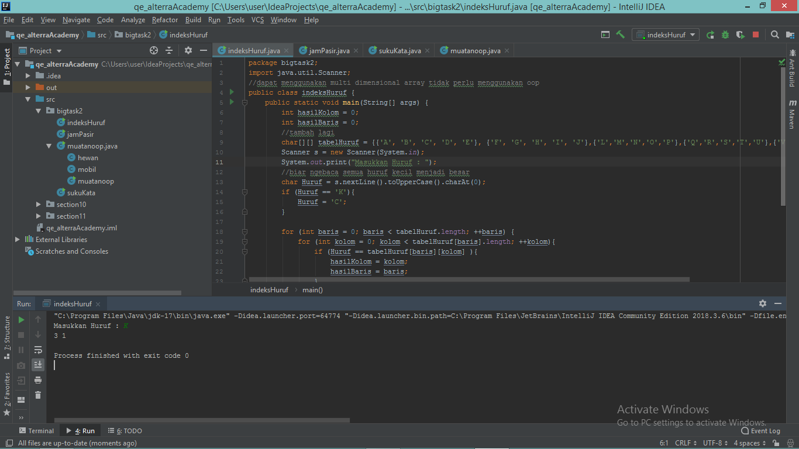

# Big Task 2 - Pemograman

## Jawaban No 1 - Jam Pasir
[jamPasir.java](./praktikum/jamPasir.java)

## Jawaban No 2 - Suku Kata O
[sukuKata.java](./praktikum/sukuKata.java)

## Jawaban No 3 - Muatan OOP
[muatanoop.java](./praktikum/muatanoop.java)

## Jawaban No 4 - Index Huruf
[indeksHuruf.java](./praktikum/indeksHuruf.java)

